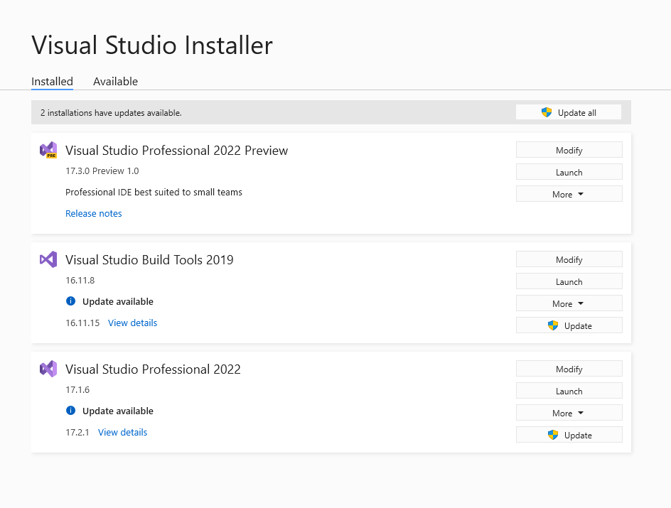
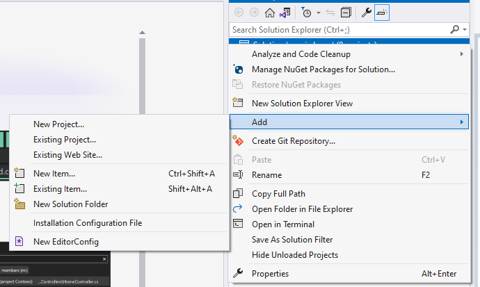
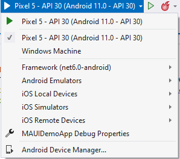
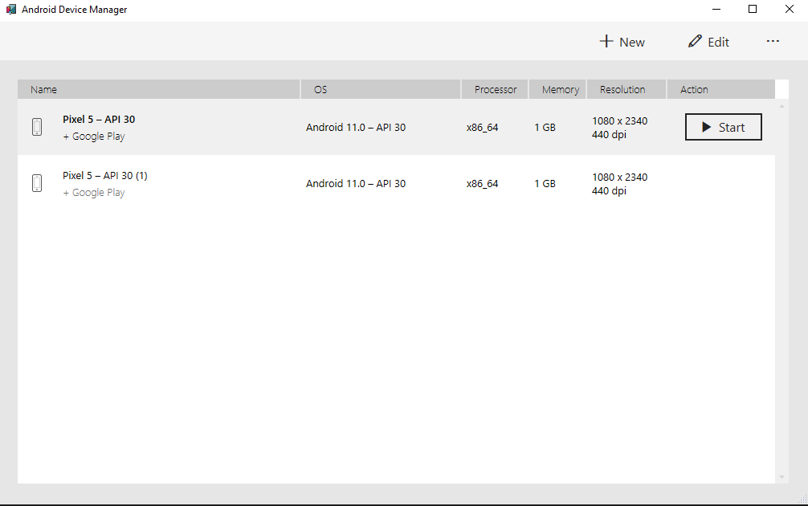
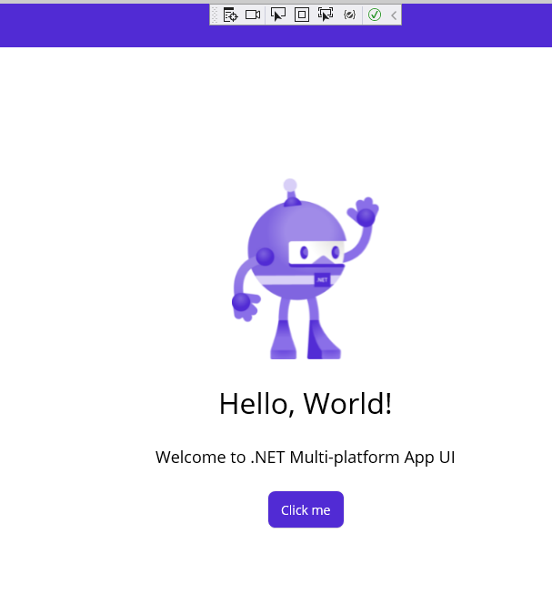

# Introducing .NET MAUI

## Architecture

> .NET MAUI is a multi-platform framework for creating native desktop and mobile apps with C# and XAML. .NET MAUI is an acronym for Multi-platform Application User Interface. Using .NET MAUI, you can design mobile apps that can run on Windows, Android, iOS, iPadOS, and macOS.

> .NET MAUI enables you to reuse the same application code and markup for creating a user interface (UI), and easily access hardware and platform-specific features, like the phone dialer and location services. Additionally, with .NET MAUI you can make use of the C# skills of the developers you already work with.

> A common pattern used for cross-platform app development is to factor the business logic from the user interface, and then develop separate user interfaces and UI logic for each platform. While the business logic remains unchanged for each type of device, the code that drives the app and presents the data can vary. This variance is because of the differing capabilities, APIs, and features provided by the devices. Building a multi-platform app in this way involves dealing with not only separate SDKs, but altogether different languages and toolsets.

> The purpose of .NET MAUI is to simplify multi-platform app development. Using .NET MAUI, you create multi-platform apps using a single project, but you can add platform-specific source code and resources if necessary. The key aim of .NET MAUI is to enable you to implement as much of your application logic and UI layout as possible in a single code-base.

> NET provides a series of platform-specific frameworks for creating apps: .NET for Android, .NET for iOS (and iPadOS), .NET for Mac, and WinUI 3 (leveraging the Windows App SDK). These frameworks all have access to the same .NET 6 Base Class Library (BCL). This library provides the functionality for creating and managing resources, and for generally abstracting the details of the underlying device away from your code. The BCL depends on the .NET runtime to provide the execution environment for your code. For Android, iOS (and iPadOS), and macOS, the environment is implemented by Mono, an open-source implementation of the .NET runtime. On Windows, Win32 performs the same role, except it's optimized for the Windows platform.

> A subset of these libraries are provided with each .NET implementation. Base class library (BCL) APIs are expected with any .NET implementation, both because developers will want them and because popular libraries will need them to run. App-specific libraries above the BCL, such as ASP.NET, will not be available on all .NET implementations.

> The BCL provides the most foundational types and utility functionality and is the base of all other .NET class libraries. The BCL aims to provide general implementations without bias to any workload. Performance is an important consideration, since apps might prefer a particular policy, such as low-latency to high-throughput or low-memory to low-CPU usage. The BCL is intended to be high-performance generally, and take a middle-ground approach according to these various performance concerns. For most apps, this approach has been quite successful.

> While the BCL enables applications running on different types of devices to share common business logic, the various platforms have different ways of defining the user interface for an application, and they provide varying models for specifying how the elements of a user interface communicate and inter-operate. You can craft the UI for each platform separately using the appropriate platform-specific framework (.NET for Android, .NET for iOS, .NET for Mac, or WinUI 3), but this approach then requires you to maintain a code-base for each individual family of devices. .NET MAUI provides a single framework for building the UIs for mobile and desktop applications. You create the UI using this framework (indicated by arrow 1 in the diagram below), and .NET MAUI takes care of converting it to the appropriate platform (arrow 2).

> .NET MAUI abstracts the implementation of a UI element from its logical description. You can describe the UI using XAML, a platform-neutral language based on XML.

> .NET MAUI always generates native code for the target device, so you get optimal performance. .NET MAUI uses "handlers" specific to each platform and UI element to carry out an operation. For example, if you target iOS for the app, a .NET MAUI handler will map this code to an iOS UIButton. If you run on Android, you'll get an Android AppCompatButton. These handlers are accessed indirectly through a control-specific interface provided by .NET MAUI, such as IButton for a button.

> .NET MAUI makes it easy to access common controls such as buttons. Other common controls, like text entry fields, labels, and date pickers are just as easy. But individual controls aren't enough to make a good platform for creating rich apps. .NET MAUI also provides:

- >An elaborate layout engine for designing pages.
- >Multiple page types for creating rich navigation types, like drawers.
- >Support for data-binding, for more elegant and maintainable development patterns.
- >The ability to create custom handlers to enhance the way in which UI elements are presented.
- >Access to native APIs directly and an abstraction of many common needs of mobile & desktop apps that are separate from the UI. The essentials library enables an app to access things like the GPS, the accelerometer, and battery and network states. There are dozens of sensors and services common to mobile development also available through this library.

> To create .NET MAUI apps, you currently require Visual Studio version 17.3 Preview (the latest preview build of Visual Studio 2022) with the following workload installed - .NET Multi-Platform App UI development

At this point it is relevant to point out that .NET MAUI is only available in Visual Studio 2022 Preview. It requires a [separate download](https://visualstudio.microsoft.com/vs/preview/). Once you have downloaded VS2022 Preview you run the installation through the Visual Studio Installer. You would select your workloads specifically for .NET MAUI or in my case you could add ASP.NET and Web Development along with a few others. 

Once you have the preview setup you will be running the two versions of Visual Studio on the same machine. 

At this point it is important to note that .NET MAUI is part of Visual Studio 2022 Preview. Its current status is RC. General Availability is scheduled for the second quarter of the year - [.NET MAUI Roadmap](https://github.com/dotnet/maui/wiki/Roadmap). 

Note that you can create .NET MAUI from the .NET Core CLI as well as Visual Studio through a project template. If you open a terminal utility - cmd or Windows Terminal - you can type the command `dotnet new -l`. 

A few other interesting bits are listed in the templates - the screenshot above did not take everything into account. 

We will create a vanilla project for the Blazor-App as well as the XAML app. In fact lets create an empty sln file and add a project of each to the solution for better comparsion. You can create an empty SLN file using the .NET CLI. Create a folder somewhere on your machine called maui-demo. Navigate to the folder and type the command `dotnet new sln --name maui-demo`. Back in Visual Studio open the sln file. It should open with no projects added. Add a new project by right-clicking on the solution.

Note the different project types for .NET MAUI.

1. .NET MAUI App - uses XAML
2. .NET MAUI Blazor App
3. .NET MAUI Class Library

Select the .NET MAUI App.

Now we have two projects - one using XAML, the other uses Blazor. The biggest thing to take note of here is the targets.

We can target Windows, Android and iOS from a single codebase. You won't be able to run iOS on your local dev machine (if it runs Windows). You would need an iOS device connected or have a remote iOS device. The same goes for targeting macOS. By default the project targets a Pixel 5. You can setup additional Android Emulators from the Android Device Manager.

When you click New you get a whole list of other devices. 

Lets run the XAML app. Before you run it - its important at this point to state you should enable HyperV. 

Once installed you can debug the application. 

You can run the same app targeting Windows. 

## Resources

- [Framework libraries](https://docs.microsoft.com/en-us/dotnet/standard/framework-libraries)|Microsoft Docs
- [Introduction](https://docs.microsoft.com/en-us/learn/dotnet-maui/build-mobile-and-desktop-apps/1-introduction)
- [Describe the .NET MAUI architecture](https://docs.microsoft.com/en-us/learn/dotnet-maui/build-mobile-and-desktop-apps/2-describe-maui-architecture)