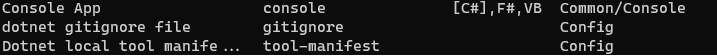
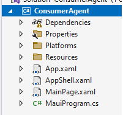

# .NET MAUI - My first impressions

## Important Disclaimer

I know very little about desktop development, or as they like to call it these days native application development. In my career so far I have mostly been involved in writing backend API services consumed by browser-based front-ends. So my view on desktop development in the .NET realm might be skewed. Nevertheless it is an area I have always wanted to explore even though the focus in my day-to-day work has been on the browser side of things. The last time, before my current job, I touched any form of .NET application development focusing on desktop was in 2016. I was involved in a project using a WinForms application. To be brutally honest WinForms development is something I have pretty much avoided - but why? I think it stems from the clunkiness - heaviness of WinForms development. From the heaviness of the designer to the change in mindset when coming from the web side of things. I always got the impression WinForms code was very singleton heavy. Like in the project I worked on at the time everything in the application was a singleton, or appeared to be. Static classes everywhere. I'm not saying it is wrong - but if you have worked with .NET Core it just feels different. I only started working on .NET Core 1.0 in 2017 - but at the time I also found the ASP.NET Framework to be "better" in many ways. The way I have been developing systems for the last while separated the UI development from the backend development. Typically you would develop your backend using something like ASP.NET WebApi. The frontend would then be developed using a framework such as Angular. The separation felt clear - you do backend (C#) code in Visual Studio. Frontend development is then done using something like VSCode. The two disciplines required a different hat - you switch context if you will. JavaScript has a different mindset with its own nuances. It feels a lot different to coding a backend C# service. 

I always viewed WinForms as a tool for creating a quick and dirty utility app to make the management of something easier. In some cases it makes sense to have a little standalone app performing a specific function. In a sense its easier to whip up a WinForms app. Doing something similar in say an Angular app requires a lot more ceremony. With Angular you have to first create a component, a service, hook it up to an API endpoint etc. With a WinForms app you can basically just start writing some C# code to perform a specific task with an added visual element. Utility WinForm apps do not always go into production - they remain kind of in the wings. 

In 2022 I was exposed to WinForms development again - it feels very painful and clunky. Maybe I'm wrong but the designer for WinForms fills me with a sense of dread. I also find state management in WinForms a mystery. You can either do it "right" using an MVVM pattern or do it "wrong" placing events and things in the code-behind. I guess at the end of the day it matters very little - its the customer who drives the business. They care very little about the technology being used. 

Back to the topic at hand - .NET MAUI. When I saw or heard (or read) about .NET MAUI the first time I saw it as an opportunity to learn XAML - do a reset if you will. You see I was one of those people who skipped XAML (WPF). I skipped it because it felt as if WPF was or is a rabbit hole of note. It always felt a lot more complex than WinForms. So when .NET MAUI surfaced I felt it was an opportunity to do a reset on my XAML skills. I also skipped the entire Xamarin development experience. 

Nothing in life is permanent - technologies come and go. Learning .NET MAUI today might not result in me using it on a fulltime basis - but I might learn something. In the vain of learning something I completed the modules on [Microsoft Learn](https://docs.microsoft.com/en-us/learn/paths/build-apps-with-dotnet-maui/). I would like to reflect on the learning by revisiting the topics covered. Passing through it once is never going to be enough to understand it better. The only real way to understand is to systematically go through the bits, make notes and try to build something. Things only become clearer when you dig into the details. Digging into the details means doing things by trial-and-error.

To make the process a bit more interesting I am going to be writing some code - creating a .NET MAUI app from scratch. So one idea I have is to create an app to track ny shopping trips - lets call it ConsumerAgent. So basically everytime I go to the shop to buy stuff I capture the items on the slip. The idea is to build up a dataset of all my purchases over a period of time. I'm not going to over engineer it or create something exessively complicated - maybe over time it will become a bit more complex. But as developers our ideas and apps never really go as far as we envisioned. The purpose of the app is to explore as much of the features in .NET MAUI. More importantly it is about learning.

## Lets get started

So the first step is to create a new .NET MAUI project - you can do this either through Visual Studio or the .NET CLI. So for the moment I am going to use the .NET CLI. So before I create the project its good practice to create a `gitignore`. The .NET CLI has a template command to create a `gitignore`. If you run the command `dotnet new -l` it displays a list of templates.

Using the template saves you the tedious trouble of finding a gitignore for Visual Studio. So to get the `gitignore` simply run `dotnet new gitignore`. Then you create a new solution file using `dotnet new sln --name ConsumerAgent` followed by `dotnet new maui --name ConsumerAgent`. You can then add the newly create project to the solution using `dotnet sln add ConsumerAgent\ConsumerAgent.csproj`. Then using Visual Studio open `ConsumerAgent.sln`.

So one of the first things I wanted to revisit is the project structure for a give .NET MAUI project. I think its important to know where things are meant to go. A few things are immediately visible in the default project.

1. App.xaml
    > This file defines the application resources that the app will use in the XAML layout. The default resources are located in the Resources folder and define app wide colors and default styles for every built-in control of .NET MAUI.
2. AppShell.xaml 
    - > This file is the main structure of a .NET MAUI application. The .NET MAUI Shell provides many features that are beneficial for multiple-platform apps including app styling, URI based navigation, and layout options including flyout navigation and tabs for the root of the application."
3. MainPage.xaml
    - > This file contains the user interface definition. The sample app generated by the MAUI App template comprises three labels, a button, and an image. The controls are arranged using a VerticalStackLayout enclosed in a ScrollView. The VerticalStackLayout control causes the controls to be arranged vertically (in a stack), and the ScrollView provides a scrollbar if the view is too large to be displayed on the device. The intention is that you replace the contents of this file with your own UI layout. You can also define more XAML pages if you have a multi-page app.
4. MauiProgram.cs
    - > Each native platform has a different starting point that creates and initializes the application. You can find this code under the Platforms folder in the project. This code is platform-specific, but at the end it calls the CreateMauiApp method of the static MauiProgramclass. You use the CreateMauiApp method to configure the application by creating an app builder object. At a minimum, you need to specify which class describes your application. You do this with the UseMauiApp generic method of the app builder object; the type parameter specifies the application class. The app builder also provides methods for tasks such as registering fonts, configuring services for dependency injection, registering custom handlers for controls, and more.

So In my mind the `MauiProgram.cs` acts as a `StartUp.cs` if you were to equate it to ASP.NET Core. Okay so we have our little project - in the next few phases or iterations I will try my best to wrap my head around the styling of .NET MAUI applications. I want to try and break the posts I am going to write into a series of posts - I do not want to write a too lengthy post at this point. 

I have written [some notes on an Introduction to .NET MAUI](introducing-net-maui.md). But I really want to take it a bit further. 

Stay tuned!

