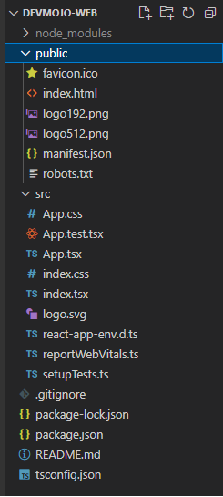

# My first React steps

## Introduction

I have been working with React for the last 3 months or so having come from Angular projects. The impression I have of React when compared to something like Angular is the overall heaviness involved with the latter. Angular itself cannot be directly compared to React as its a fully fledged framework with routing already included. React does not by itself include routing - you have to add it yourself. I'm not going down a rabbithole of comparing the two trying to identify the "best" one. Instead I am going to focus on doing things - trying to better understand it as far as possible.

## Build tooling

The first aspect I want to explore with React is the frontend build tooling - webpack, vite and the like. 

### Vite

I am going to try and setup a basic Vite build from the [StackBlitz example shown in documentation](https://stackblitz.com/edit/vitejs-vite-za2k8t?file=package.json&terminal=dev). I'll start of by using `npx create` to create the react app. From there I'll configure `package.json`. I have also become very familiar with TypeScript - the advantages of using it have become apparent through usage. Discussing TypeScript is another topic altogether though. Lets start.

1. To create a new react app with TypeScript support you use the command from the [documentation](`https://create-react-app.dev/docs/adding-typescript/`). I created a new project devmojo-web using the `npx create-react-app devmojo-web --template typescript`. After the command run the solution has a structure. 

2. The next step will be to get vite working. From the StackBlitz example the first thing would be to update the `package.json`.
    1. Update `type` to `module`