# Styling your .NET MAUI App

## It all starts somewhere

As part of the learning process I want to create a small application using .NET MAUI. The application will run on Windows for the time being. .NET MAUI is a great alternative to WinForms or WPF. Why not right? The idea for my application is super simple - create an application to capture the receipts from all my shopping trips to the various retail shops - lets call it ConsumerAgent. You can [view the repository](https://github.com/thefremus/ConsumerAgent). I think it could be interesting to build up a dataset of shopping trips over an extended period of time. Imagine seeing the price of bread over a period of time or any other grocery item for that matter.

The application will start off consisting of two pages. The first page will list my most recent retailer trips. The second page will allow me to capture the transaction receipts.

I created a basic wireframe just to aid my planning of the application. It helps thinking up front just a bit. It doesn't have to be pretty to be effective.

The purpose of building the application is to learn about the features of .NET MAUI - bit by bit. The idea is to build features in the app targeting specific aspects of .NET MAUI. It feels as if there is a lot to learn. The first thing I would like to look at is styling. I would like to understand the basic syntax of the styling. Styling refers to the font, colours and general appearance of elements in the application. Why styling? Well in the learning I did up to this point I found the styling syntax in the XAML as something of interest. It could be a desire to understand the XAML syntax better as well. I also found the concept of the Resource Dictionary interesting. 

## Setting it up

Before I can even get to the styling we have to shave the yak a bit.

I have to start by creating the pages. One of the great features of .NET MAUI is this idea of pages. They kind of look like separate forms - if you were to think of them in WinForms terms. Except they act like pages in a typical web application - they use actual navigation. You can even pass query parameters to a page. Being able to think in terms of "pages" in a desktop app feels weird. The benefit of using pages also means isolating view logic. 

When you create a .NET MAUI project from the CLI or Visual Studio it contains a MainPage - but you are not restricted to use the MainPage. In fact I decided to delete it. You can define the startup page in the AppShell. In the example below the MainPage is used. 

Just as a sidenote - what is XAML again? Why use it? [The official documentation gives a decent overview](https://docs.microsoft.com/en-us/dotnet/maui/xaml/). But basically as I understand it everything you can do in XAML can be done in code. XAML does allow you to separate the view component of your code from the events or interactions. In your XAML you can define a button - it is then hooked up to a click event in the code behind (.cs) file. In a sense Angular also works in a similar way if you think about it. When you create an Angular component it has two distinct parts - a component file containing the TypeScript (ts) alongside a component file containing the HTML. In the TypeScript file you define all the events for the HTML view. A difference though is that Angular supports directives for loops and conditions - XAML does not support any conditional elements. 

I deleted the default MainPage. I then created two pages, `RetailerTrips` and `AddReceipt`. I want `RetailerTrips` to be the startup page so I updated the route in the App Shell XAML.

Layouts are another topic I would love to understand better - but for now I'll just use grid layouts. All I know at this stage it is important to understand a grid is a layout component - not a tabular data component. 

## BindingContext - ICommand

In one of the [code samples on Microsoft Learn](https://github.com/microsoftdocs/mslearn-dotnetmaui-consume-rest-services) they use a BindingContext in the constructor of a page.

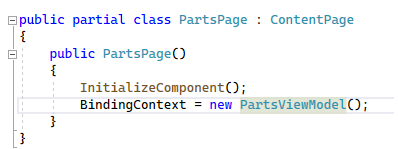

In the code they then use Commands instead of click events. A `Command` uses an `ICommand` interface. In the app I am creating I need to navigate from `RetailerTrips` to the `AddReceipt` page. To navigate between the pages I can add an event handler for the `Clicked` event but it feels as if the Command binding approach looks cleaner. To navigate from the `RetailerTrips` page to the `AddReceipt` page I update the button markup.

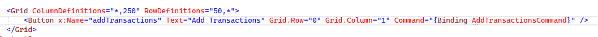

I created a `RetailerTripsViewModel` class - it is the BindingContext for the page. I then created a command in the view model class.

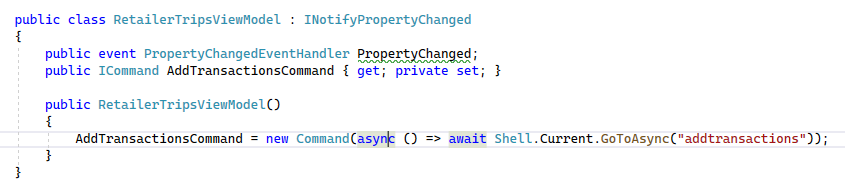

Notice the code performing the navigation - `await Shell.Current.GoToAsync("addtransactions")`. I also added a route in the constructor of `AppShell.cs`.

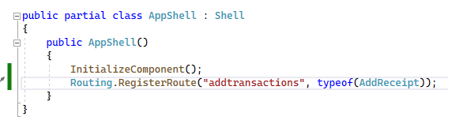

If I run the code I can click on the `Add Transactions` button and it navigates to the correct page. 

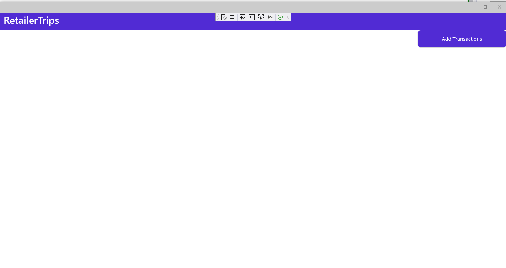

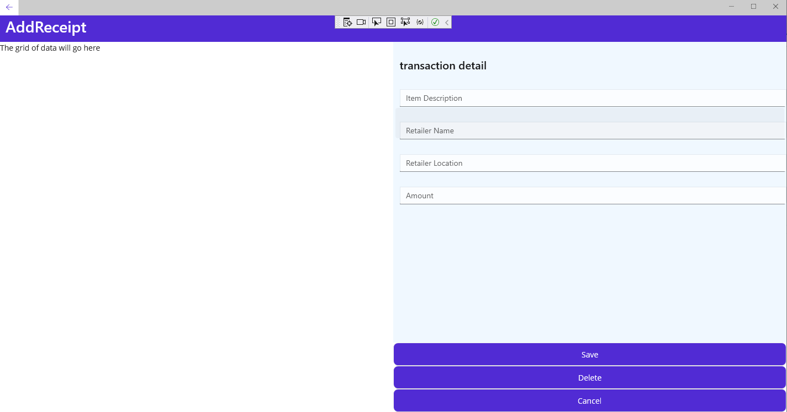

Still a lot of work to do to make the application look and work great. But it would be fair to say MichaelAngelo did not end up with a carved angel from the start. 

## Lets get onto the styling

Styling a .NET MAUI application can either be at a component level, a page level or at an application level. Styling a .NET MAUI component directly is probably the least maintainable. If, for instance, you set the color on a button at the component level it means having to edit the value each time a change occurs. The second approach is to apply styling at a page level. You can add a ResourceDictionary at the page level. 

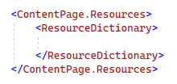

The third approach is to use application wide styling by adding a ResourceDictionary to App.xaml.

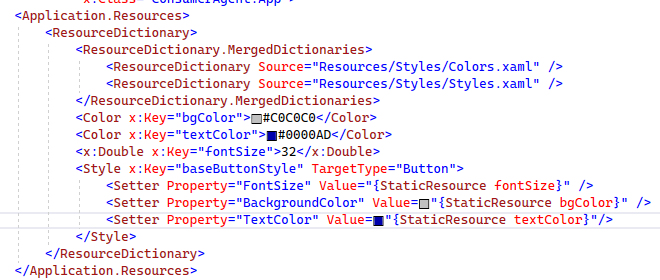

In the example above I created a style called `baseButtonStyle`. It sets the font size to 32. It also sets the text and background colors. You can then use the style in your page. In the `AddReceipt` page I can reference the styles.

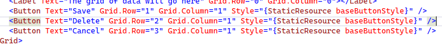

After applying the styles you can see the buttons have changed.

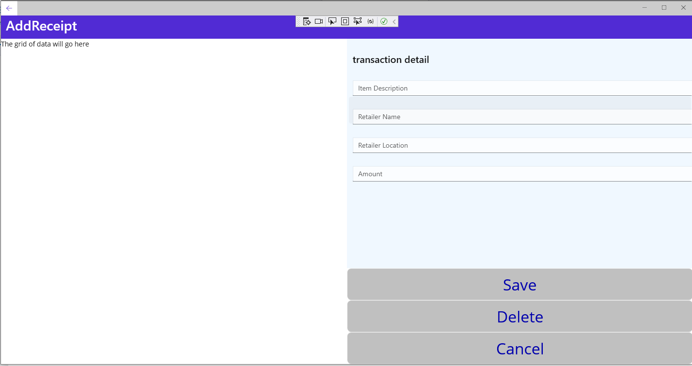

I can apply the styling to the button on the `RetailerTrips` page as well. 

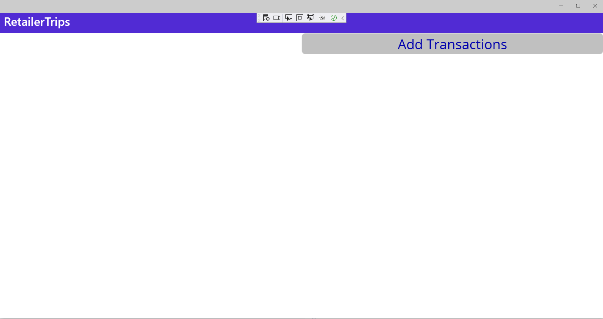

Not pretty - but it conveys the concept clearly.

## Next steps

I think I have barely touched the surface with regards to styling .NET MAUI apps. In addition to setting up application wide styling you can also inherit styling at a page level. Inheriting it at a page level allows you to override the base style with custom values or adding additional styling. Apart from styling there are other important aspects as well - like layouts. I will be looking at understanding layouts better next. 

Thanks for reading!